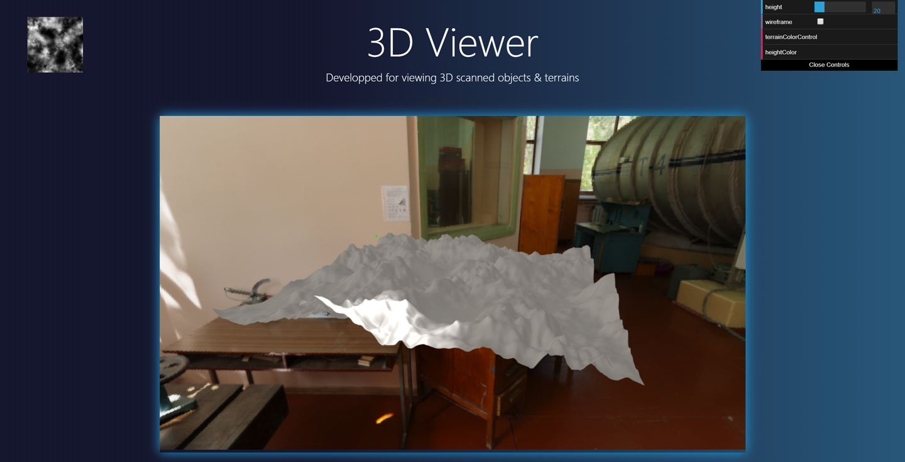
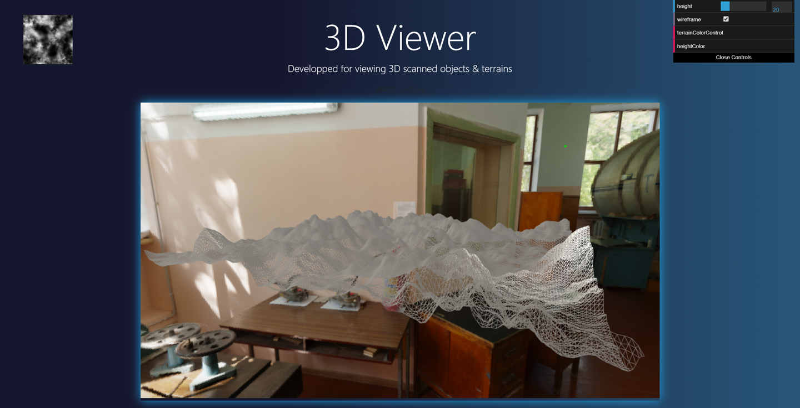
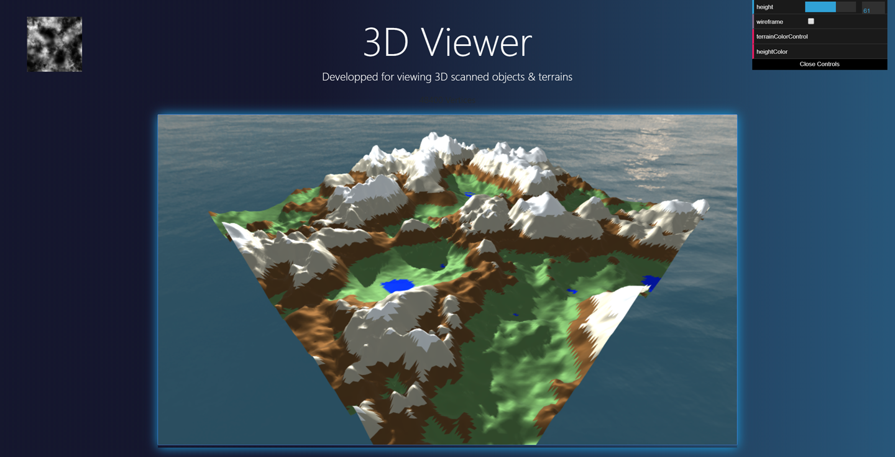

# Three.js 3D Heightmap visualizer
 Three JS WebGL application for visualisation of Heightmaps through your web-browser, has support for VR

**This application was developped as part of a personnal project aimed for scanning reliefs and surfaces,that used the translation of a proximity sensor to output a greyscaled heightmap.**
 
 **the visualizer is now uploaded as a standalone Three.JS / WebGL demo for fun and learning.**
 

### Landing page

### Classic heightmap view

### Wireframe view

### Terrain vertices automatic colorization

### Height based vertices colorization

