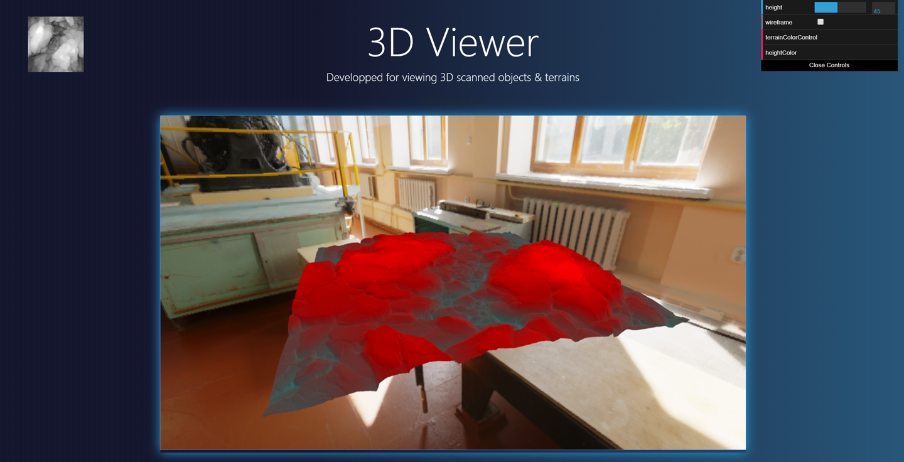

# Three.js 3D Heightmap visualizer
 Three JS WebGL application for visualisation of Heightmaps through your web-browser, has support for VR

**This application was developped as part of a personnal project aimed for scanning reliefs and surfaces,that used the translation of a proximity sensor to output a greyscaled heightmap.**
 
 **the visualizer is now uploaded as a standalone Three.JS / WebGL demo for fun and learning.**
 

### Landing page

### Classic heightmap view

### Wireframe view

### Terrain vertices automatic colorization

### Height based vertices colorization

You do need a local web server to run this web application, as CORS policy ask to.
I recommand using [Python](https://docs.python.org/3/library/http.server.html "Python server documentation") or a [Node.js server](https://nodejs.org/en/docs/guides/getting-started-guide/ "NodeJS server documentation")